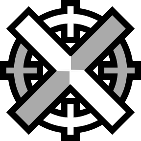
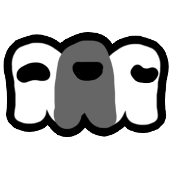
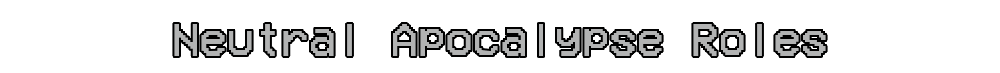
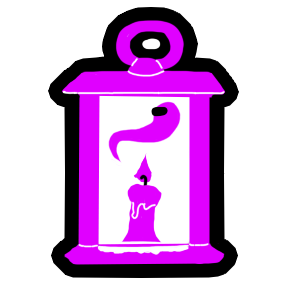

> [!NOTE]
> This is an extension mod to [Town of Us: Mira](https://github.com/AU-Avengers/TOU-Mira), and will not work without it.

-----------------------

  
  
Town Of Us Mira JK Mod

 

An extension mod to [Town of Us: Mira](https://github.com/AU-Avengers/TOU-Mira), adding many new roles and few modifiers.

-----------------------

  
  
  
  
  
  
  
  
  
  
  
  
  
  
  
  
  
  
  
  
  
  
  
  
  
  
  
  
  
  
  
  
  
  
  
  
  
  
  
  
  
  
  
  
  

<b>And more...</b>

-----------------------
# Role Explanations
## Crewmate Roles
### Coroner
Alignment: <b>Crewmate Investigative</b>

The Coroner is a role that can Autopsy bodies to gather information about them and the killer.\
Possible Autopsy results:
- Whether the killer is lighter or darker color.
- In which cardinal direction the killer escaped.
- How did the killer escape.
- How many other players were killed by the killer.
- Role of the killer.
- Whether the kill was indirect.
- How long ago the victim died.
- Role of the victim.

Game Options:
| Name | Description | Default |
|----------|:-------------:|:------:|
| Autopsy Cooldown | Cooldown of the Autopsy ability. | 10s |
| Max Autopsies Per Body | Maximum Autopsies per dead body. | 3 |
| Show Autopsy Result During Round | Show Autopsy results immidiately. | True |
| Track Killer's Movement For | Time after murder up until which escape direction and escape method are updated. | 10s |

### Inspector
Alignment: <b>Crewmate Investigative</b>

The Inspector is a role that can Inspect players to learn what roles they may be.\
If the `Use Doomsayer Results` option is turned on, the results will be identical to the Doomsayer's Observe.\
Otherwise the result will be composed of random roles in amounts configured by options, one of which is that of the Inspected player.

Game Options:
| Name | Description | Default |
|----------|:-------------:|:------:|
| Inspect Cooldown | Cooldown of the Inspect ability. | 25s |
| Use Doomsayer Results | Whether to use the same results as Doomsayer's Observe. | True |
| Crewmate Roles In Report | The amount of crewmate roles in the report. | 3 |
| Neutral Roles In Report | The amount of neutral roles in the report. | 2 |
| Impostor Roles In Report | The amount of impostor roles in the report. | 2 |

### Watcher
Alignment: <b>Crewmate Investigative</b>

The Watcher is a role that can Watch to zoom out their vision and see through walls.\
While Watching the Watcher cannot move.

Game Options:
| Name | Description | Default |
|----------|:-------------:|:------:|
| Watch Cooldown | Cooldown of the Watch ability. | 25s |
| Watch Duration | How long the Watch ability lasts. | 10s |
| Watch Vision Multiplier | How much the screens zooms out while watching. | 1.25x |

### Executor
Alignment: <b>Crewmate Killing</b>

The Executor is a role that can Aim at players to later Execute one of them during meeting.

Game Options:
| Name | Description | Default |
|----------|:-------------:|:------:|
| Aim Cooldown | Cooldown of the Aim ability. | 25s |
| Max Aimed Players | Maximum amount of alive Aimed players. | 5 |
| Reveal Role After Executing | Whether to reveal Executor's role to everyone after Executing. | False |

### Monster Hunter
Alignment: <b>Crewmate Killing</b>

The Monster Hunter is a role that can Stake players to check if they are a monster, and killing them if they are.\
The player is treated as a monster if they are a Vampire, Werewolf or Undead.

Game Options:
| Name | Description | Default |
|----------|:-------------:|:------:|
| Stake Cooldown | Cooldown of the Stake ability. | 25s |
| Max Failed Stakes Per Game | Maximum amount of incorrect Stakes per game. | 5 |
| Can Stake Round One | Whether the Monster Hunter can stake round one. | False |
| Self Kill When Run Out of Stakes | Commit suicide if ran out of stakes. | False |
| Becomes on Monsters Death | What Monster Hunter becomes after killing all monsters. | Crewmate |

### Bodyguard
Alignment: <b>Crewmate Protective</b>

The Bodyguard is a role that can Guard players to protect them from attacks.\
When the target is attacked, the Bodyguard teleports between the attacker and the victim, and killing themself and the attacker.

Game Options:
| Name | Description | Default |
|----------|:-------------:|:------:|
| Guard Cooldown | Cooldown of the Guard ability. | 25s |
| Guard Duration | Duration of the Guard ability. | 30s |

### Crusader
Alignment: <b>Crewmate Protective</b>

The Crusader is a role that can Fortify players to attack the first person that interacts with them.

Game Options:
| Name | Description | Default |
|----------|:-------------:|:------:|
| Fortify Cooldown | Cooldown of the Fortify ability. | 25s |
| Fortify Duration | Duration of the Fortify ability. | 30s |
| Max Uses of Fortify | Maximum amount of Fortify uses. | 5 |

### Tavern Keeper
Alignment: <b>Crewmate Support</b>

The Tavern Keeper is a role that can Drink with players to temporarely disable their abilities.

Game Options:
| Name | Description | Default |
|----------|:-------------:|:------:|
| Drink Cooldown | Cooldown of the Drink ability. | 25s |
| Reset Drinks Every Round | Whether to reset remaining drinks at the start of the round. | True |
| Max Drinks | Maximum amount of Drink uses. | 5 |
| Drink Duration | Duration of the Drink ability. | 20s |

### Undercover
Alignment: <b>Crewmate Support</b>

The Undercover is a role that is seen as random Impostor to other Impostor.\
The role Undercover is disguised as can be seen on modifier tab.

Game Options:
| Name | Description | Default |
|----------|:-------------:|:------:|
| Impostors Can Kill Eachother With Undercover Present | Whether Impostors can kill eachother if Undercover is in play. | True |
| Cover Can Be Impostor Concealing | Whether Undercover can be disguised as Impostor Concealing | True |
| Cover Can Be Impostor Killing | Whether Undercover can be disguised as Impostor Killing | True |
| Cover Can Be Impostor Power | Whether Undercover can be disguised as Impostor Power | True |
| Cover Can Be Impostor Support | Whether Undercover can be disguised as Impostor Support | False |

## Impostor Roles
### Poisoner
Alignment: <b>Impostor Killing</b>

The Poisoner is a role that can Poison players to kill them after set amount of time.

Game Options:
| Name | Description | Default |
|----------|:-------------:|:------:|
| Poison Kills After | Time after Poison after which the Poisoned player dies. | 15s |
| Announce Poison To The Victim | Whether the victim learns that they were poisoned. | True |
| Poison Announcement Delay | The time between being Poisoned and announcing Poison to the victim. | 5s |
| Poisoner Can Use Normal Kill | Whether Poisoner can use normal kill button. | True |

### Sniper
Alignment: <b>Impostor Killing</b>

The Sniper is a role that can Aim at a player to Shoot them, killing them whenever they want.

Game Options:
| Name | Description | Default |
|----------|:-------------:|:------:|
| Aim Cooldown | Cooldown of the Aim ability. | 10s |
| Show Arrow To The Aimed Player | Whether Sniper sees an arrow towards the victim. | True |
| Aimed Arrow Update Interval | Interval between updates of the arrow pointing towards the victim. | 2.5s |
| Announce Sniper Shot | Whether to announce when the Sniper used their Shoot ability. | True |
| Point To The Sniper | Whether to show arrow towards Sniper after they used the Shoot ability. | True |
| Point To The Victim | Whether to show arrow towards the victim after the Sniper used the Shoot ability. | True |
| Pointing Arrow Duration | Duration of the arrows pointing towards sniper and victim. | 1s |
| Sniper Can Use Normal Kill | Whether Sniper can use normal kill button. | True |

### Demagogue
Alignment: <b>Impostor Power</b>

The Demagogue is a role that cannot be ejected while their immunity lives.\
On the start of the game a random Neutral role is marked as immunity.\
If there are no Neutral roles in the game, the immunity becomes one of the other Impostors instead.\
If there are no Neutral roles or other Impostors in the game, the immunity becomes a random Crewmate instead.\
All Impostors and the immunity see who the immunity is.\
On the first meeting, the Demagogue's identity is revealed, and players learn the immunity's alignment.\
Regardless of the settings, the immunity can always kill the Demagogue.

Game Options:
| Name | Description | Default |
|----------|:-------------:|:------:|
| Demagogue Kill Cooldown Increase | Increase to the Demagogue's kill cooldown. | 10s |
| Punich Voters If Immunity Lives | Whether to kill the voters after failing to eject the Demagogue. | True |
| Demagogue Can Be Killed By Crew Roles | Whether the Demagogue can be killed by Crewmate roles. | False |
| Demagogue Can Be Killed By Non-Crew Roles | Whether the Demagogue can be killed by Non-Crewmate roles. | True |
| Give Hints About Who Isn't Immunity | Whether to announce a random player that isn't immunity on start of every meeting. | True |
| Announce Immunity Death | Whether to announce whether the immunity died on the start of the meeting. | False |

### Godfather

## Neutral Roles
### Cursed Soul

### Witch

### Bloodhound

### Jackal

### Necromancer

### Pirate

### Baker

### Famine

### Berserker

### War

### Soul Collector

### Death

## Modifiers
### Prophet

### Tasker

### Drunk

-----------------------
# Credits
<b>@craftrpl</b> on Discord for role icons.

# License
This software is distributed under the GNU GPLv3 License. BepInEx is distributed under the LGPL-2.1 License.

# Copyright

This mod is not affiliated with Among Us or Innersloth LLC, and the content contained therein is not endorsed or otherwise sponsored by Innersloth LLC. Portions of the materials contained herein are property of Innersloth LLC.

© Innersloth LLC.

