> [!NOTE]
> This is an extension mod to [Town of Us: Mira](https://github.com/AU-Avengers/TOU-Mira), and will not work without it.

-----------------------

  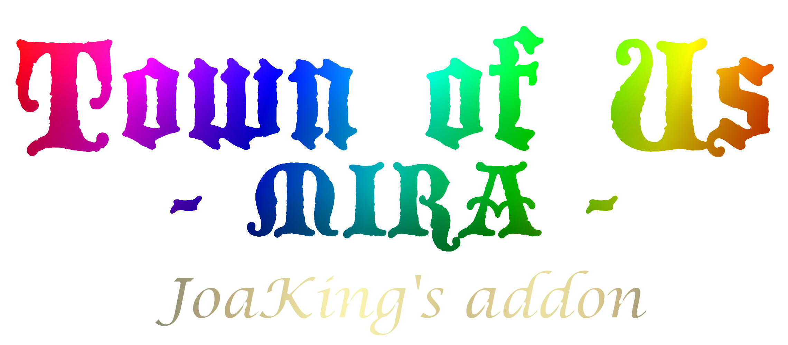

 

An extension mod to [Town of Us: Mira](https://github.com/AU-Avengers/TOU-Mira), adding many new roles and few modifiers.

-----------------------

  
  <a href="#coroner-">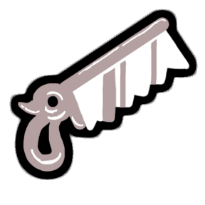</a>
  <a href="#inspector-">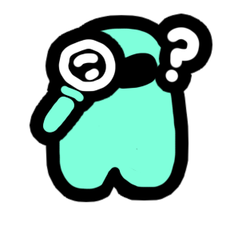</a>
  <a href="#watcher-">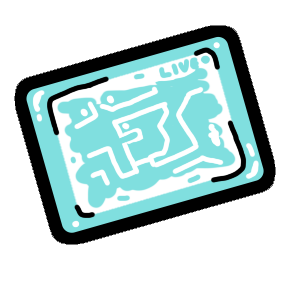</a>
  
  
  <a href="#monster-hunter-">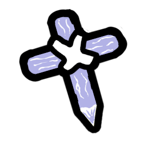</a>
  
  
  
  <a href="#bodyguard-">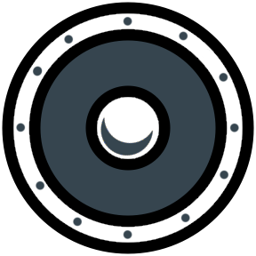</a>
  <a href="#crusader-">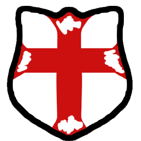</a>
  <a href="#sanctifier-">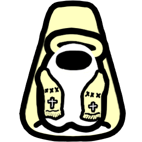</a>
  
  <a href="#tavern-keeper-">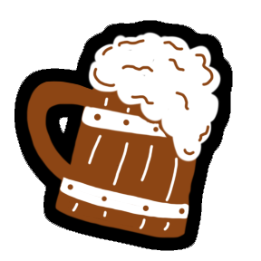</a>
  <a href="#undercover-">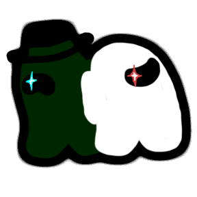</a>
  
  
  <a href="#poisoner-">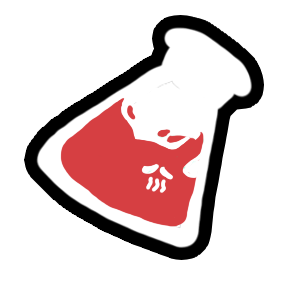</a>
  <a href="#sniper-">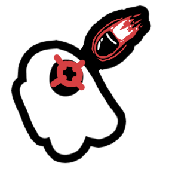</a>
  
  <a href="#demagogue-">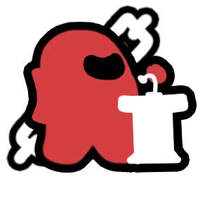</a>
  <a href="#godfather-">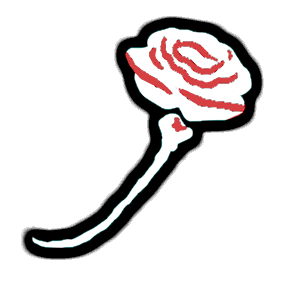</a>
  
  
  <a href="#cursed-soul-">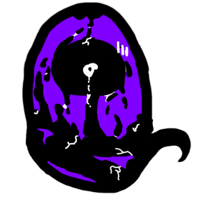</a>
  
  <a href="#witch-">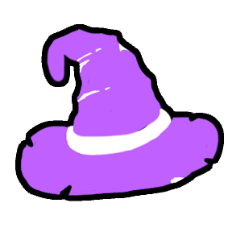</a>
  
  
  <a href="#berserker-">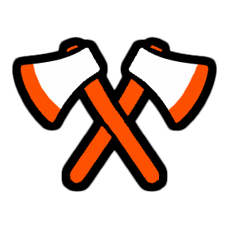</a>
  <a href="#war-">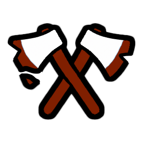</a>
  <a href="#bloodhound-">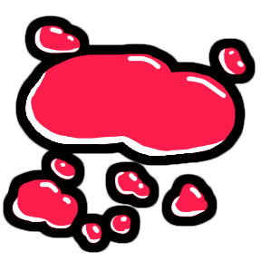</a>
  <a href="#shadow-">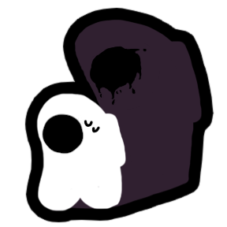</a>
  
  <a href="#baker-">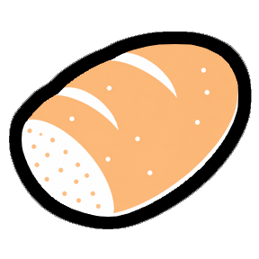</a>
  <a href="#famine-">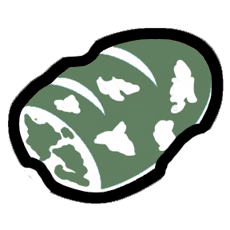</a>
  <a href="#manhunter-">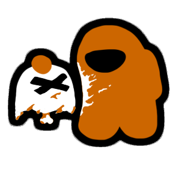</a>
  <a href="#necromancer-">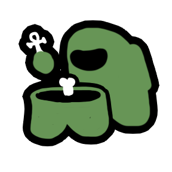</a>
  <a href="#pirate-">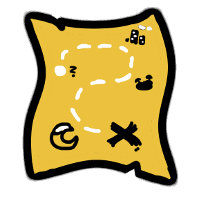</a>
  
  <a href="#death-">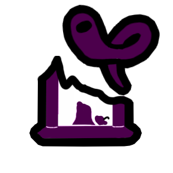</a>
  
  
  <a href="#prophet-">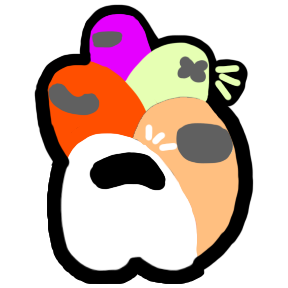</a>
  
  
  <a href="#outcast-">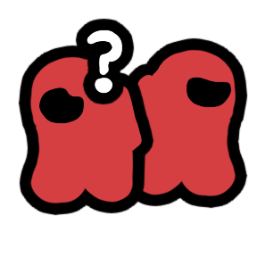</a>
  
  <a href="#drunk-">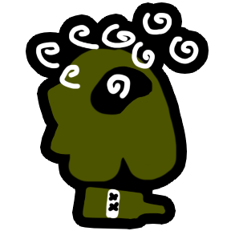</a>

-----------------------
# Other changes
- Imitator's Wiki entry now automatically detects all roles with Crew Variants and updates them.

-----------------------
# Apocalypse
Apocalypse is a new faction to Neutral roles.\
The goal of the Apocalypse is to reach majority with no other killers left alive.\
All of the Apocalypse roles are in the same faction, and win together.\
All of the Apocalypse roles have a goal to reach, after which they transform into a stronger version of itself.\
To the Apocalypse roles belong: Baker, Famine, Berserker, War, Plaguebearer, Pestilence, Soul Collector and Death.

-----------------------
# Role Explanations
## Crewmate Roles
### Coroner 
Alignment: <b>Crewmate Investigative</b>\
Inspiration: <b>The Other Roles (Medium)</b>

The Coroner is a role that can Autopsy bodies to gather information about them and the killer.\
Possible Autopsy results:
- Whether the killer is lighter or darker color.
- In which cardinal direction the killer escaped.
- How did the killer escape.
- How many other players were killed by the killer.
- Role of the killer.
- Whether the kill was indirect.
- How long ago the victim died.
- Role of the victim.

Game Options:
| Name | Description | Default |
|----------|:-------------:|:------:|
| Autopsy Cooldown | Cooldown of the Autopsy ability. | 10s |
| Max Autopsies Per Body | Maximum Autopsies per dead body. | 3 |
| Show Autopsy Result During Round | Show Autopsy results immidiately. | True |
| Track Killer's Movement For | Time after murder up until which escape direction and escape method are updated. | 10s |

### Inspector 
Alignment: <b>Crewmate Investigative</b>\
Inspiration: <b>Town Of Us Reactivated (old Detective)</b>, <b>Town Of Salem (Investigator)</b>

The Inspector is a role that can Inspect players to learn what roles they may be.\
If the `Use Doomsayer Results` option is turned on, the results will be identical to the Doomsayer's Observe.\
Otherwise the result will be composed of random roles in amounts configured by options, one of which is that of the Inspected player.

Game Options:
| Name | Description | Default |
|----------|:-------------:|:------:|
| Inspect Cooldown | Cooldown of the Inspect ability. | 25s |
| Use Doomsayer Results | Whether to use the same results as Doomsayer's Observe. | True |
| Crewmate Roles In Report | The amount of crewmate roles in the report. | 3 |
| Neutral Roles In Report | The amount of neutral roles in the report. | 2 |
| Impostor Roles In Report | The amount of impostor roles in the report. | 2 |

### Watcher 
Alignment: <b>Crewmate Investigative</b>\
Inspiration: <b>[Det2203](https://github.com/FERTAILS) (Lookout)</b>

The Watcher is a role that can Watch to zoom out their vision and see through walls.\
While Watching the Watcher cannot move.

Game Options:
| Name | Description | Default |
|----------|:-------------:|:------:|
| Watch Cooldown | Cooldown of the Watch ability. | 25s |
| Watch Duration | How long the Watch ability lasts. | 10s |
| Watch Vision Multiplier | How much the screens zooms out while watching. | 1.25x |

### Gunslinger 
Alignment: <b>Crewmate Killing</b>\
Inspiration: <b>Town Of Salem 2 (Deputy)</b>

The Gunslinger is a role that can Aim at players to later Shoot one of them during meeting.

Game Options:
| Name | Description | Default |
|----------|:-------------:|:------:|
| Aim Cooldown | Cooldown of the Aim ability. | 25s |
| Max Aimed Players | Maximum amount of alive Aimed players. | 5 |
| Reveal Role After Shooting | Whether to reveal Gunslinger's role to everyone after Shooting. | False |

### Monster Hunter 
Alignment: <b>Crewmate Killing</b>\
Inspiration: <b>Town Of Us Reactivated (Vampire Hunter)</b>

The Monster Hunter is a role that can Stake players to check if they are a monster, and killing them if they are.\
The player is treated as a monster if they are a Vampire, Werewolf or Undead.\
If there are no monsters, the Monster Hunter won't spawn.

Game Options:
| Name | Description | Default |
|----------|:-------------:|:------:|
| Stake Cooldown | Cooldown of the Stake ability. | 25s |
| Max Failed Stakes Per Game | Maximum amount of incorrect Stakes per game. | 5 |
| Can Stake Round One | Whether the Monster Hunter can stake round one. | False |
| Self Kill When Run Out of Stakes | Commit suicide if ran out of stakes. | False |
| Becomes on Monsters Death | What Monster Hunter becomes after killing all monsters. | Crewmate |

### Secretary 
Alignment: <b>Crewmate Power</b>\
Inspiration: <b>Town Of Us Reactivated (old Mayor)</b>

The Secratary is a role that can Store votes, abstaining from the vote at the meeting.\
After Storing a vote, the Secretary can decide to cast multiple votes at one meeting.

Game Options:
| Name | Description | Default |
|----------|:-------------:|:------:|
| Initial Stored Votes | Amount of Stored votes on the start of the game. | 2 |
| Maximum Stored Votes | Maximum amount of Stored votes. | 5 |

### Bodyguard 
Alignment: <b>Crewmate Protective</b>\
Inspiration: <b>Town Of Salem 2 (Bodyguard)</b>

The Bodyguard is a role that can Guard players to protect them from attacks.\
When the target is attacked, the Bodyguard teleports between the attacker and the victim, and killing themself and the attacker.

Game Options:
| Name | Description | Default |
|----------|:-------------:|:------:|
| Guard Cooldown | Cooldown of the Guard ability. | 25s |
| Guard Duration | Duration of the Guard ability. | 30s |

### Crusader 
Alignment: <b>Crewmate Protective</b>\
Inspiration: <b>Town Of Salem 2 (Crusader)</b>

The Crusader is a role that can Fortify players to attack the first person that interacts with them.

Game Options:
| Name | Description | Default |
|----------|:-------------:|:------:|
| Fortify Cooldown | Cooldown of the Fortify ability. | 25s |
| Fortify Duration | Duration of the Fortify ability. | 30s |
| Max Uses of Fortify | Maximum amount of Fortify uses. | 5 |

### Sanctifier 
Alignment: <b>Crewmate Protective</b>\
Inspiration: <b>[xChipseq](https://github.com/xChipseq) (Aurial)</b>

The Sanctifier is a role that can Sanctify an area to prevent players to use all abilities in that area.

Game Options:
WIP

### Tavern Keeper 
Alignment: <b>Crewmate Support</b>\
Inspiration: <b>Town Of Salem 2 (Tavern Keeper)</b>

The Tavern Keeper is a role that can Drink with players to temporarely disable their abilities.

Game Options:
| Name | Description | Default |
|----------|:-------------:|:------:|
| Drink Cooldown | Cooldown of the Drink ability. | 25s |
| Reset Drinks Every Round | Whether to reset remaining drinks at the start of the round. | True |
| Max Drinks | Maximum amount of Drink uses. | 5 |
| Drink Duration | Duration of the Drink ability. | 20s |

### Undercover 
Alignment: <b>Crewmate Support</b>\
Inspiration: <b>The Other Roles (Spy)</b>

The Undercover is a role that is seen as random Impostor role to other Impostor.\
The role Undercover is disguised as can be seen on modifier tab.

Game Options:
| Name | Description | Default |
|----------|:-------------:|:------:|
| Impostors Can Kill Eachother With Undercover Present | Whether Impostors can kill eachother if Undercover is in play. | True |
| Cover Can Be Impostor Concealing | Whether Undercover can be disguised as Impostor Concealing. | True |
| Cover Can Be Impostor Killing | Whether Undercover can be disguised as Impostor Killing. | True |
| Cover Can Be Impostor Power | Whether Undercover can be disguised as Impostor Power. | True |
| Cover Can Be Impostor Support | Whether Undercover can be disguised as Impostor Support. | False |
| Undercover Can Vent | Whether Undercover can Vent if the role Undercover is disguised as can also Vent. | True |
| Undercover Can Move In Vents | Whether Undercover can move between Vents. | False |

## Impostor Roles
### Poisoner 
Alignment: <b>Impostor Killing</b>\
Inspiration: <b>Town Of Us Reactivated (Poisoner)</b>

The Poisoner is a role that can Poison players to kill them after set amount of time.

Game Options:
| Name | Description | Default |
|----------|:-------------:|:------:|
| Poison Kills After | Time after Poison after which the Poisoned player dies. | 15s |
| Announce Poison To The Victim | Whether the victim learns that they were poisoned. | True |
| Poison Announcement Delay | The time between being Poisoned and announcing Poison to the victim. | 5s |
| Poisoner Can Use Normal Kill | Whether Poisoner can use normal kill button. | True |

### Sniper 
Alignment: <b>Impostor Killing</b>\
Inspiration: <b>Own Idea/Inspiration Unclear</b>

The Sniper is a role that can Aim at a player to Shoot them, killing them whenever they want.

Game Options:
| Name | Description | Default |
|----------|:-------------:|:------:|
| Aim Cooldown | Cooldown of the Aim ability. | 10s |
| Show Arrow To The Aimed Player | Whether Sniper sees an arrow towards the victim. | True |
| Aimed Arrow Update Interval | Interval between updates of the arrow pointing towards the victim. | 2.5s |
| Announce Sniper Shot | Whether to announce when the Sniper used their Shoot ability. | True |
| Point To The Sniper | Whether to show arrow towards Sniper after they used the Shoot ability. | True |
| Point To The Victim | Whether to show arrow towards the victim after the Sniper used the Shoot ability. | True |
| Pointing Arrow Duration | Duration of the arrows pointing towards sniper and victim. | 1s |
| Sniper Can Use Normal Kill | Whether Sniper can use normal kill button. | True |

### Demagogue 
Alignment: <b>Impostor Power</b>\
Inspiration: <b>Own Idea/Inspiration Unclear</b>

The Demagogue is a role that cannot be ejected while their immunity lives.\
On the start of the game a random Neutral role is marked as immunity.\
If there are no Neutral roles in the game, the immunity becomes one of the other Impostors instead.\
If there are no Neutral roles or other Impostors in the game, the immunity becomes a random Crewmate instead.\
All Impostors and the immunity see who the immunity is.\
On the first meeting, the Demagogue's identity is revealed, and players learn the immunity's alignment.\
Regardless of the settings, the immunity can always kill the Demagogue.

Game Options:
| Name | Description | Default |
|----------|:-------------:|:------:|
| Demagogue Kill Cooldown Increase | Increase to the Demagogue's kill cooldown. | 10s |
| Punich Voters If Immunity Lives | Whether to kill the voters after failing to eject the Demagogue. | True |
| Demagogue Can Be Killed By Crew Roles | Whether the Demagogue can be killed by Crewmate roles. | False |
| Demagogue Can Be Killed By Non-Crew Roles | Whether the Demagogue can be killed by Non-Crewmate roles. | True |
| Give Hints About Who Isn't Immunity | Whether to announce a random player that isn't immunity on start of every meeting. | True |
| Announce Immunity Death | Whether to announce whether the immunity died on the start of the meeting. | False |

### Godfather 
Alignment: <b>Impostor Power</b>\
Inspiration: <b>Own Idea/Inspiration Unclear</b>

The Godfather is a role that can Recruit a player into their faction turning them into Mafioso.\
The player being Recruited by Godfather must be a Crewmate with no Alliance Modifiers, otherwise the Recruiting fails.

Game Options:
| Name | Description | Default |
|----------|:-------------:|:------:|
| Mafioso Kill Cooldown Increase | Increase to the Mafioso's kill cooldown. | 10s |
| Godfather Can Kill With Mafioso Alive | Whether the Godfather can kill with Mafioso alive. | False |
| Godfather Can Kill Before Recruiting | Whether the Godfather can kill before Recruiting. | False |
| Mafioso Dies With Godfather | Whether the Mafioso dies when Godfather dies. | True |

## Neutral Roles
### Cursed Soul 
Alignment: <b>Neutral Benign</b>\
Inspiration: <b>Town Of Salem 2 (old Cursed Soul)</b>

The Cursed Soul is a role that can Soul Swap with players to gain their role.\
The Cursed Soul cannot win by themself until they get a role.

Game Options:
| Name | Description | Default |
|----------|:-------------:|:------:|
| Soul Swap Cooldown | Cooldown of the Soul Swap ability. | 25s |
| Random Swap Target Chance | Chance of swapping with a random player instead of the target. | 50% |
| Swap Faction Modifier | Whether the Cursed Soul gains the player's Faction Modifier. | True |
| Swap Assassin Modifier | Whether the Cursed Soul gains the player's Assassin Modifier. | True |
| Can Swap With Impostor | Whether the Cursed Soul can Soul Swap with an Impostor. | False |
| Can Swap With Neutral Killer | Whether the Cursed Soul can Soul Swap with Neutral Killing. | True |
| Can Swap With Neutral Apocalypse | Whether the Cursed Soul can Soul Swap with Neutral Apocalypse. | False |
| Kill On Non-Valid Swap | Whether the Cursed Soul dies on non-valid swap,\if false the Cursed Soul will always get an random person's role after targeting a non-valid target. | True |
| Swapped Player Becomes | What the target becomes after Soul Swap. | Cursed Soul |

### Witch 
Alignment: <b>Neutral Evil</b>\
Inspiration: <b>Town Of Salem (Witch)</b>

The Witch is a role that can force players to use their ability.\
The Witch wins when the Crewmates lose and they survived.\
Alternatively they leave in victory when there are no Crewmates left alive.\
The Witch can Mark a player, to later Control them into using their ability.\
Witch will learn if they were successful in forcing the player to use their ability, and which one they used (by keybind).

Game Options:
| Name | Description | Default |
|----------|:-------------:|:------:|
| Control Cooldown | Cooldown of the Control ability. | 25s |
| Witch Learns | What the Witch learns about the player after using Control. | Alignment |

### Ammit 
Alignment: <b>Neutral Killing</b>\
Inspiration: <b>Goose Goose Duck (Pelican)</b>

The Ammit is a role that can Devour players killing them if Ammit survives up to the next meeting.\
When Ammit is killed, all players Devoured by them will appear at the Ammit's body.

Game Options:
| Name | Description | Default |
|----------|:-------------:|:------:|
| Devour Cooldown | Cooldown of the Devour ability. | 20s |
| Devour Cooldown Increase Per Devour | Increase to the cooldown of the Devour ability per Devoured player. | 5s |
| Max Devoured Per Round | Maximum Devoured players per round. | Infinite |
| Size Increase Per Person Devoured | By how much Ammit's size is increased per Devoured player. | 2.5% |
| Ammit Can Vent | Whether the Ammit can Vent. | False |

### Berserker 
Alignment: <b>Neutral Killing</b>\
Inspiration: <b>Town Of Salem 2 (Berserker)</b>

The Berserker is a role that can kill players, lowering their cooldown with each kill.\
After reaching a certain kill thershold, they transform into War, Horseman of the Apocalypse.

#### War 
Alignment: <b>Neutral Killing</b>\
Inspiration: <b>Town Of Salem 2 (War)</b>

The War is a role that can kill multiple players without reseting the kill cooldown, provided they kill fast enough.\
The War is immune to all attacks and can only be killed by being voted out.

Game Options:
| Name | Description | Default |
|----------|:-------------:|:------:|
| Instant War Chance | Chance to become War immediately at the start of the game. | 0% |
| Berserker Initial Kill Cooldown | Initial cooldown of Berserker's kill button. | 25s |
| Berserker Kill Cooldown Reduction | Decrease to Berserker's kill button cooldown per killed player. | 5s |
| Berserker Can Vent | Whether the Berserker can vent. | True |
| Kills Needed To Transform | Kill threshold, after which Berserker transforms into War. | 4 |
| Announce War Transformation | Whether to announce War transformation on the meeting after transformation. | True |
| War Kill Cooldown | Cooldown of War's kill button. | 10s |
| War Killing Spree Duration | Duration during which War can kill without reseting the kill cooldown. | 1s |
| War Can Vent | Whether the War can Vent. | True |

### Bloodhound 
Alignment: <b>Neutral Killing</b>\
Inspiration: <b>Town Of Salem 2 (Serial Killer)</b>

The Bloodhound is a role that can kill players.\
After killing a certain amount of players, they enter Bloodlust.\
Bloodlust lasts a certain amount of time, during which Bloodhound's kill cooldown is lowered.\
Kills during Bloodlust still count towards another Bloodlust, so Bloodhound can have theoretically infinite Bloodlust.

Game Options:
| Name | Description | Default |
|----------|:-------------:|:------:|
| Kill Cooldown | Cooldown of Bloodhound's kill button. | 25s |
| Kills To Bloodlust | Amount of kills after reaching which Bloodhound enters Bloodlust. | 3 |
| Kill Cooldown On Bloodlust | Cooldown of Bloodhound's kill button while in Bloodlust. | 10s |
| Bloodlust Duration | Duration of Bloodhound's Bloodlust condition. | 30s |
| Bloodhound Can Vent | Whether the Bloodhound can Vent. | True |

### Shadow 
Alignment: <b>Neutral Killing</b>\
Inspiration: <b>Own Idea/Inspiration Unclear</b>

The Shadow is a role that can kill players, with two additional abilities.\
Vanish makes the shadow have very low opacity, be anonymous and move faster.\
Darkness turns out vision for <i>all</i> other players (including Impostors).

Game Options:
| Name | Description | Default |
|----------|:-------------:|:------:|
| Kill Cooldown | Cooldown of Shadow's kill button. | 25s |
| Vanish Cooldown | Cooldown of the Vanish ability. | 25s |
| Vanish Duration | How long the Vanish ability lasts. | 10s |
| Shadow Transparency During Vanish | Shadow's opacity during Vanish. | 5% |
| Shadow Speed During Vanish | Shadow's speed multiplier during Vanish. | x1.25 |
| Darkness Cooldown | Cooldown of the Darkness ability. | 25s |
| Darkness Duration | How long the Darkness ability lasts. | 10s |
| Shadow Can Vent | Whether the Shadow can Vent. | False |

### Baker 
Alignment: <b>Neutral Outlier</b>\
Inspiration: <b>Town Of Salem 2 (Baker)</b>

The Baker is a role that can give Bread to players.\
After they give a certain amount of bread out, they transform into Famine, Horseman of the Apocalypse.

#### Famine 
Alignment: <b>Neutral Outlier</b>\
Inspiration: <b>Town Of Salem 2 (Famine)</b>

The Famine is a role that can Starve players to make them lose Bread.\
If the player is meant to lose Bread but they don't have any, they die.\
Additionally every so often and after meetings all players lose 1 Bread due to passive starvation.

Game Options:
| Name | Description | Default |
|----------|:-------------:|:------:|
| Bread Needed To Transform | Amount of players fed needed for Baker to transform into Famine. | 0% |
| Bread Cooldown | Cooldown of the Bread ability. | 25s |
| Bread Lasts For | How much charges of Bread are given. | 5s |
| Not Enough Players Effect | What happens to the Baker when there are not enough players to transform. | Transform |
| Announce Famine Transformation Delay | Time after transforming, after which the players are notified about transformation. | 10s |
| Famine Can Vent | Whether the Famine can Vent. | False |
| Starve Ability Cooldown | Cooldown of the Starve ability. | 25s |
| Starve Ability Strength | Amount of Bread, that player targeted by Starve ability loses. | 1 |
| Passive Starving Interval | Interval between passive starvation events. | 35s |

### Manhunter 
Alignment: <b>Neutral Outlier</b>\
Inspiration: <b>Own Idea/Inspiration Unclear</b>

### Necromancer 
Alignment: <b>Neutral Outlier</b>\
Inspiration: <b>Own Idea/Inspiration Unclear</b>

### Pirate 
Alignment: <b>Neutral Outlier</b>\
Inspiration: <b>Town Of Salem 1 & 2 (Pirate)</b>

### Reaper 
Alignment: <b>Neutral Outlier</b>\
Inspiration: <b>Town Of Salem 2 (Soul Collector)</b>

#### Death 
Alignment: <b>Neutral Outlier</b>\
Inspiration: <b>Town Of Salem 2 (Death)</b>

## Modifiers
### Prophet 
Inspiration: <b>Better Town Of Salem 2 (Apoc Town Traitor)</b>

### Tasker 
Inspiration: <b>Community Sugestion (Tasker by [CraftR](https://github.com/CraftManiakpl))</b>

### Outcast 
Inspiration: <b>Community Sugestion (Unknown by @brzozuwka)</b>

### Drunk 
Inspiration: <b>Town Of Us (Drunk)</b>

-----------------------
# Credits
[CraftR](https://github.com/CraftManiakpl) for role icons and buttons.

# License
This software is distributed under the GNU GPLv3 License. BepInEx is distributed under the LGPL-2.1 License.

# Copyright

This mod is not affiliated with Among Us or Innersloth LLC, and the content contained therein is not endorsed or otherwise sponsored by Innersloth LLC. Portions of the materials contained herein are property of Innersloth LLC.

© Innersloth LLC.

